# n8n Flows: Finance Agent Orchestration

โฟลว์ n8n ทำหน้าที่เป็น **Orchestrator** คอยเชื่อมโยงข้อมูลจาก LINE OA, ระบบ AI OCR, ระบบวิเคราะห์ภาษา (Embeddings) และการบันทึกข้อมูลเข้าฐานข้อมูล PostgreSQL

---

## 🛠️ โครงสร้างขั้นตอนของโฟลว์ (Workflow Steps)

```mermaid
graph LR
    LineWebhook[LINE Webhook Node] --> TypeCheck{ข้อความ/ภาพ?}
    TypeCheck -- เป็นรูปภาพ --> GetMedia[LINE Get Media Node]
    GetMedia --> GeminiVision[Gemini Vision Node]
    GeminiVision --> ParseJson[Parse JSON Node]
    
    TypeCheck -- เป็นข้อความ --> TextLLM[Qwen/Gemini Text Node]
    TextLLM --> ParseJson
    
    ParseJson --> SaveHeader[Postgres: Insert Expense]
    SaveHeader --> LoopItems[Loop Line Items]
    
    LoopItems --> EmbedItem[Ollama Embed: bge-m3]
    EmbedItem --> MapCOA[Postgres: Match Cosine Distance]
    MapCOA --> SaveItem[Postgres: Insert Expense Item]
    
    SaveItem --> SendFlex[LINE Send: Flex Confirmation Card]
```



---

## 📋 คำแนะนำการกำหนดคอนฟิกแต่ละโหนด (Node Configuration Guidelines)

### 1. LINE Webhook
* **Path**: `/webhook/finance-line-agent`
* **Response**: เลือก `Respond Immediately` เพื่อหลีกเลี่ยงการติด Timeout 5 วินาทีของ LINE

### 2. Gemini OCR Vision Node (หรือเรียกผ่าน OpenRouter)
* **API Endpoint**: `https://openrouter.ai/api/v1/chat/completions` (ใช้ Model: `google/gemini-2.5-flash`)
* **Prompt**:
  ```text
  You are an expert AI accountant. Read the attached receipt image and extract the fields in structured JSON format.
  If there are calculations like (Subtotal + VAT != Grand Total), do NOT correct them yet. Extract them exactly as written and set `is_corrupted = true` with a clear explanation in `correction_notes`.
  
  JSON Schema Response:
  {
    "vendorName": "String",
    "transactionDate": "YYYY-MM-DD",
    "subtotal": Number,
    "vatAmount": Number,
    "totalAmount": Number,
    "paymentMethod": "cash" | "credit_card" | "transfer",
    "isCorrupted": Boolean,
    "correctionNotes": "String",
    "items": [
      { "description": "String (Thai or English)", "amount": Number }
    ]
  }
  ```

### 3. Ollama Embed Node
* **URL**: `http://localhost:11434/api/embed`
* **Model**: `bge-m3:latest`
* **Input**: ให้รวมข้อความเพื่อช่วยเพิ่มบริบทในการจำแนก เช่น `{{$json["description"]}}`

### 4. Postgres Match COA Node
* **SQL Query**:
  ```sql
  SELECT code, name, name_th, (1 - (embedding <=> '{{$json["embedding"]}}'::vector)) as similarity
  FROM chart_of_accounts
  ORDER BY similarity DESC
  LIMIT 1;
  ```
  *(เมื่อค้นหาพบแล้ว ให้ดึงรหัสบัญชี `code` ไปบันทึกลงในตาราง `expense_items`)*

### 5. LINE Send Flex Message
* ส่งการ์ดคอนเฟิร์มปุ่มกด Flex Message ให้พนักงานกดยืนยันการส่งล้างหนี้ (Submit Expense)
